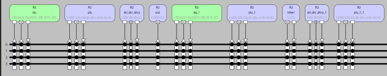
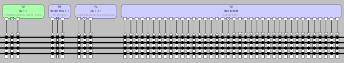
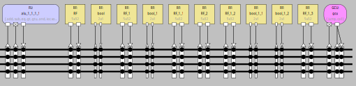
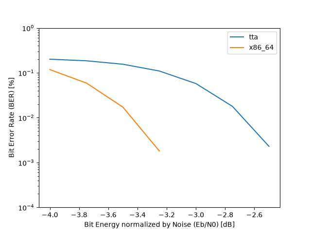

An open-source "end-to-end" 5GNR baseband processor project, implementing
L1 (Physical Layer) kernels.

Current architecture:




Processor simulation (Proxim) window (paused during LDPC code/decode simulation):


Machine View and Processor utilization stats (paused LDPC code/decode simulation):


```bash
>info proc stats

utilizations
------------

buses:

B1              27.396% (77343630 writes)
B1_1            43.123% (121743807 writes)
B1_2            68.5108% (193417983 writes)
B1_3            80.9124% (228429864 writes)

sockets:

lsu_i1          11.3744% (32111808 writes)
lsu_o1          2.91767% (8237102 writes)
lsu_i2          4.66146% (13160107 writes)
alu_comp_i1     19.2896% (54457959 writes)
alu_comp_i2     18.9868% (53602947 writes)
alu_comp_o1     15.8942% (44872001 writes)
RF_i1           5.73772% (16198567 writes)
RF_o1           11.1922% (31597418 writes)
bool_i1         10.9103% (30801801 writes)
bool_o1         0.00133361% (3765 writes)
gcu_i1          10.0562% (28390494 writes)
gcu_i2          0.614125% (1733780 writes)
gcu_o1          1.08332% (3058410 writes)
RF_1_o1         4.15895% (11741445 writes)
RF_1_i1         7.96197% (22478022 writes)
shl_shr_shru_i1 1.92333% (5429884 writes)
shl_shr_shru_i2 1.92322% (5429581 writes)
shl_shr_shru_o1 1.37702% (3887558 writes)
FU_i1           0.091429% (258120 writes)
lsu_1_i1        6.01353% (16977224 writes)
lsu_1_o1        1.24127% (3504310 writes)
lsu_1_i2        2.96402% (8367938 writes)
alu_1_i1        13.4242% (37898869 writes)
alu_1_i2        10.7582% (30372136 writes)
alu_1_o1        11.5591% (32633435 writes)
timer_i2        1.63869% (4626318 writes)
timer_o2        0.429337% (1212093 writes)
shl_shr_shru_1_i1 1.38399% (3907236 writes)
shl_shr_shru_1_i2 1.38388% (3906933 writes)
shl_shr_shru_1_o1 1.59116% (4492125 writes)
alu_1_1_i1      14.2659% (40274974 writes)
alu_1_1_i2      13.7529% (38826872 writes)
alu_1_1_o1      10.5258% (29716047 writes)
bool_1_o1       0% (0 writes)  
bool_1_i1       0% (0 writes)  
RF_1_1_o1       2.59892% (7337208 writes)
RF_1_1_i1       3.25201% (9181001 writes)
lsu_1_1_i1      4.01877% (11345678 writes)
lsu_1_1_o1      0.302926% (855213 writes)
lsu_1_1_i2      2.56881% (7252182 writes)
shl_shr_shru_1_1_i1 0.839263% (2369385 writes)
shl_shr_shru_1_1_i2 0.835244% (2358039 writes)
shl_shr_shru_1_1_o1 0.903508% (2550761 writes)
alu_1_1_1_i1    9.12021% (25747920 writes)
alu_1_1_1_i2    8.50979% (24024617 writes)
alu_1_1_1_o1    3.42227% (9661648 writes)
check_node_i2   0.0194958% (55040 writes)
check_node_i3   0.0194958% (55040 writes)
check_node_i4   0.0194958% (55040 writes)
check_node_i5   0.0194958% (55040 writes)
check_node_i6   0.0194958% (55040 writes)
check_node_i7   0.0194958% (55040 writes)
check_node_i8   0.0194958% (55040 writes)
check_node_i9   0.0194958% (55040 writes)
check_node_i10  0.0194958% (55040 writes)
check_node_i11  0.0194958% (55040 writes)
check_node_i12  0.0194958% (55040 writes)
check_node_i13  0.0194958% (55040 writes)
check_node_i14  0.0194958% (55040 writes)
check_node_i15  0.0194958% (55040 writes)
check_node_i16  0.0194958% (55040 writes)
check_node_i17  0.0194958% (55040 writes)
check_node_i18  0.0194958% (55040 writes)
check_node_i19  0.0194958% (55040 writes)
check_node_o1   0% (0 writes)  
check_node_o2   0% (0 writes)  
check_node_o3   0% (0 writes)  
check_node_o4   0% (0 writes)  
check_node_o5   0% (0 writes)  
check_node_o6   0% (0 writes)  
check_node_o7   0.0194958% (55040 writes)
check_node_o8   0% (0 writes)  
check_node_o9   0% (0 writes)  
check_node_o10  0% (0 writes)  
check_node_o11  0% (0 writes)  
check_node_o12  0% (0 writes)  
check_node_o13  0% (0 writes)  
check_node_o14  0% (0 writes)  
check_node_o15  0% (0 writes)  
check_node_o16  0% (0 writes)  
check_node_o17  0% (0 writes)  
check_node_o18  0% (0 writes)  
check_node_o19  0% (0 writes)  
alu_1_1_1_1_i1  7.23467% (20424734 writes)
alu_1_1_1_1_i2  6.66591% (18819022 writes)
alu_1_1_1_1_o1  2.2526% (6359479 writes)
ldpc_decode_i1  0.0194958% (55040 writes)
RF_2_o1         1.60108% (4520140 writes)
RF_2_i1         1.88606% (5324675 writes)
RF_1_2_o1       6.15846% (17386411 writes)
RF_1_2_i1       7.6056% (21471939 writes)
bool_1_1_o1     0% (0 writes)  
bool_1_1_i1     0% (0 writes)  
bool_1_2_o1     0% (0 writes)  
bool_1_2_i1     0% (0 writes)  
RF_1_3_o1       3.32494% (9386880 writes)
RF_1_3_i1       7.91973% (22358762 writes)

operations executed in function units:

lsu:
LD32            49.5587% of FU total (15914183 executions)
LD8             7.38896% of FU total (2372728 executions)
LD16            0.000149478% of FU total (48 executions)
ST32            35.1495% of FU total (11287143 executions)
ST8             5.84113% of FU total (1875693 executions)
ST16            0.000239787% of FU total (77 executions)
LDU8            1.72911% of FU total (555248 executions)
LDU16           0.332239% of FU total (106688 executions)
TOTAL           11.3744% (32111808 triggers)

alu:
ADD             27.8923% of FU total (15189574 executions)
SUB             15.094% of FU total (8219881 executions)
EQ              39.2874% of FU total (21395116 executions)
GT              2.11269% of FU total (1150529 executions)
GTU             6.94585% of FU total (3782569 executions)
AND             5.90085% of FU total (3213480 executions)
IOR             2.49985% of FU total (1361369 executions)
XOR             0.262861% of FU total (143149 executions)
SHR1_32         0% of FU total (0 executions)
SHRU1_32        0.00420875% of FU total (2292 executions)
TOTAL           19.2896% (54457959 triggers)

shl_shr_shru:
SHL             48.803% of FU total (2649944 executions)
SHR             7.05965% of FU total (383331 executions)
SHRU            44.1374% of FU total (2396609 executions)
TOTAL           1.92333% (5429884 triggers)

out:
STDOUT          100% of FU total (258120 executions)
TOTAL           0.091429% (258120 triggers)

lsu_1:
LD32            48.1998% of FU total (8182988 executions)
LD8             1.01077% of FU total (171600 executions)
LD16            0.00116627% of FU total (198 executions)
ST32            48.8434% of FU total (8292252 executions)
ST8             0.408624% of FU total (69373 executions)
ST16            0.0515632% of FU total (8754 executions)
LDU8            1.46026% of FU total (247912 executions)
LDU16           0.0244268% of FU total (4147 executions)
TOTAL           6.01353% (16977224 triggers)

alu_1:
ADD             57.4509% of FU total (21773238 executions)
SUB             6.90377% of FU total (2616450 executions)
EQ              4.21078% of FU total (1595838 executions)
GT              2.36255% of FU total (895378 executions)
GTU             1.15021% of FU total (435916 executions)
AND             5.06052% of FU total (1917881 executions)
IOR             2.18705% of FU total (828866 executions)
XOR             1.45136% of FU total (550048 executions)
SHR1_32         1.98815% of FU total (753488 executions)
SHRU1_32        17.2347% of FU total (6531766 executions)
TOTAL           13.4242% (37898869 triggers)

timer:
RTC             100% of FU total (4626318 executions)
TOTAL           1.63869% (4626318 triggers)

shl_shr_shru_1:
SHL             30.0679% of FU total (1174823 executions)
SHR             0.711091% of FU total (27784 executions)
SHRU            69.221% of FU total (2704629 executions)
TOTAL           1.38399% (3907236 triggers)

alu_1_1:
ADD             64.1076% of FU total (25819337 executions)
SUB             6.77612% of FU total (2729082 executions)
EQ              3.41258% of FU total (1374414 executions)
GT              2.50846% of FU total (1010281 executions)
GTU             0.23928% of FU total (96370 executions)
AND             20.0411% of FU total (8071540 executions)
IOR             0.534113% of FU total (215114 executions)
XOR             2.38047% of FU total (958735 executions)
SHR1_32         0% of FU total (0 executions)
SHRU1_32        0.000250776% of FU total (101 executions)
TOTAL           14.2659% (40274974 triggers)

lsu_1_1:
LD32            35.831% of FU total (4065271 executions)
LD8             0.179073% of FU total (20317 executions)
LD16            0.00173634% of FU total (197 executions)
ST32            62.313% of FU total (7069837 executions)
ST8             1.64325% of FU total (186438 executions)
ST16            0.00323471% of FU total (367 executions)
LDU8            0.000925463% of FU total (105 executions)
LDU16           0.0277286% of FU total (3146 executions)
TOTAL           4.01877% (11345678 triggers)

shl_shr_shru_1_1:
SHL             95.5406% of FU total (2263724 executions)
SHR             0.372248% of FU total (8820 executions)
SHRU            4.08718% of FU total (96841 executions)
TOTAL           0.839263% (2369385 triggers)

alu_1_1_1:
ADD             77.9374% of FU total (20067256 executions)
SUB             5.00815% of FU total (1289495 executions)
EQ              1.72606% of FU total (444425 executions)
GT              0.479437% of FU total (123445 executions)
GTU             3.52109% of FU total (906608 executions)
AND             6.45958% of FU total (1663207 executions)
IOR             1.72352% of FU total (443771 executions)
XOR             0.122965% of FU total (31661 executions)
SHR1_32         0.0621409% of FU total (16000 executions)
SHRU1_32        2.95966% of FU total (762052 executions)
TOTAL           9.12021% (25747920 triggers)

ldpc_decode:
CHECK_NODE      100% of FU total (55040 executions)
TOTAL           0.0194958% (55040 triggers)

alu_1_1_1_1:
ADD             43.9993% of FU total (8986739 executions)
SUB             0.656567% of FU total (134102 executions)
EQ              0.745537% of FU total (152274 executions)
GT              0.561398% of FU total (114664 executions)
GTU             2.23413% of FU total (456315 executions)
AND             38.9846% of FU total (7962491 executions)
IOR             5.00847% of FU total (1022966 executions)
XOR             7.80956% of FU total (1595082 executions)
SHR1_32         0% of FU total (0 executions)
SHRU1_32        0.000494498% of FU total (101 executions)
TOTAL           7.23467% (20424734 triggers)

gcu:
JUMP            89.3002% of FU total (25352759 executions)
CALL            10.6998% of FU total (3037735 executions)
TOTAL           10.0562% (28390494 triggers)


operations:

ADD             32.5294% (91836144 executions)
AND             8.08615% (22828599 executions)
CALL            1.076% (3037735 executions)
CHECK_NODE      0.0194958% (55040 executions)
EQ              8.84185% (24962067 executions)
GT              1.16688% (3294297 executions)
GTU             2.01113% (5677778 executions)
IOR             1.37154% (3872086 executions)
JUMP            8.98023% (25352759 executions)
LD16            0.000156916% (443 executions)
LD32            9.97546% (28162442 executions)
LD8             0.908426% (2564645 executions)
LDU16           0.0403734% (113981 executions)
LDU8            0.284526% (803265 executions)
RTC             1.63869% (4626318 executions)
SHL             2.15661% (6088491 executions)
SHR             0.148746% (419935 executions)
SHR1_32         0.272561% (769488 executions)
SHRU            1.84122% (5198079 executions)
SHRU1_32        2.58444% (7296312 executions)
ST16            0.00325804% (9198 executions)
ST32            9.43946% (26649232 executions)
ST8             0.755003% (2131504 executions)
STDOUT          0.091429% (258120 executions)
SUB             5.30928% (14989010 executions)
XOR             1.16134% (3278675 executions)

FU port guard accesses:

register accesses:

RF:
0               30178771 reads, 0 guard reads,      5335648 writes 
1               20752206 reads, 0 guard reads,      8207399 writes 
2               3165511 reads, 0 guard reads,      1647369 writes 
3               933063 reads,  0 guard reads,      677829 writes  
4               330410 reads,  0 guard reads,      330322 writes  
TOTAL          55359961 reads, 0 guard reads,      16198567 writes
TOTAL 5 registers used

bool:
0               30368 reads,   66205207 guard reads, 30656861 writes
1               6738 reads,    372950 guard reads, 144940 writes  
TOTAL          37106 reads,   66578157 guard reads, 30801801 writes
TOTAL 2 registers used

RF_1:
0               22198071 reads, 0 guard reads,      12240855 writes
1               13815336 reads, 0 guard reads,      7992737 writes 
2               2742965 reads, 0 guard reads,      1170765 writes 
3               437795 reads,  0 guard reads,      400519 writes  
4               1157160 reads, 0 guard reads,      673146 writes  
TOTAL          40351327 reads, 0 guard reads,      22478022 writes
TOTAL 5 registers used

bool_1:
0               0 reads,       0 guard reads,      0 writes       
1               0 reads,       0 guard reads,      0 writes       
TOTAL          0 reads,       0 guard reads,      0 writes       
TOTAL 2 registers used

RF_1_1:
0               5054619 reads, 0 guard reads,      2364810 writes 
1               5616091 reads, 0 guard reads,      4407054 writes 
2               2298118 reads, 0 guard reads,      1360434 writes 
3               1325298 reads, 0 guard reads,      938451 writes  
4               1100800 reads, 0 guard reads,      110252 writes  
TOTAL          15394926 reads, 0 guard reads,      9181001 writes 
TOTAL 5 registers used

RF_2:
0               548891 reads,  0 guard reads,      692967 writes  
1               5917982 reads, 0 guard reads,      2886010 writes 
2               2047063 reads, 0 guard reads,      934001 writes  
3               670741 reads,  0 guard reads,      701445 writes  
4               440320 reads,  0 guard reads,      110252 writes  
TOTAL          9624997 reads, 0 guard reads,      5324675 writes 
TOTAL 5 registers used

RF_1_2:
0               22395549 reads, 0 guard reads,      17633285 writes
1               6257917 reads, 0 guard reads,      2139791 writes 
2               1262255 reads, 0 guard reads,      1297088 writes 
3               291876 reads,  0 guard reads,      291523 writes  
4               366080 reads,  0 guard reads,      110252 writes  
TOTAL          30573677 reads, 0 guard reads,      21471939 writes
TOTAL 5 registers used

bool_1_1:
0               0 reads,       0 guard reads,      0 writes       
1               0 reads,       0 guard reads,      0 writes       
TOTAL          0 reads,       0 guard reads,      0 writes       
TOTAL 2 registers used

bool_1_2:
0               0 reads,       0 guard reads,      0 writes       
1               0 reads,       0 guard reads,      0 writes       
TOTAL          0 reads,       0 guard reads,      0 writes       
TOTAL 2 registers used

RF_1_3:
0               38357763 reads, 0 guard reads,      18871299 writes
1               4019845 reads, 0 guard reads,      2087464 writes 
2               986407 reads,  0 guard reads,      1014545 writes 
3               330244 reads,  0 guard reads,      330242 writes  
4               605440 reads,  0 guard reads,      55212 writes   
TOTAL          44299699 reads, 0 guard reads,      22358762 writes
TOTAL 5 registers used
```
<!--Counterpart (same architecture, without custom Function Unit CHECK_NODE):
-->

Some performance analysis:

<!--


-->

# 2 USER GUIDE - PREREQUISITES AND BUILD

## 2.1 PREREQUISITES

You will need:
* GNU Make
* CMake
* g++
* Python (>= 3.9.x)
* [OpenASIP](https://github.com/cpc/openasip.git) (source code), release openasip-2.2

Build and install OpenASIP, as described in the project's root README.md. Then, proceed
to build this project.

## 2.2 BUILD
```bash
cd open_baseband/
make build-tta
make build-x86_64
make verilog-rtl
make vhdl-rtl
make simulate-tta # currently, this might take a while
make simulate-x86_64
make dataset-tta
make dataset-x86_64
```

### 2.2.1 make build-tta
``make build-tta`` will call CMake on target build-tta and compile all kernels in
```bash
open_baseband/openasip/targets/tta/kernels/
```
and subdirectories and place them in equivalent cmake binaries directory (in
the build tree)
```bash
open_baseband/build/openasip/build-tta/openasip/targets/tta/kernels
```
targeting the ASIP TTA architectures described in source
```bash
open_baseband/openasip/arch/5gnr_ue_baseband_proc_sim.adf
open_baseband/openasip/arch/5gnr_ue_baseband_proc_asic.adf
```
As their basenames suggest, the first one (sim) is supposed to run code 
written for simulation purposes. Because of that, it includes Function Units such
as 'out', which implement the STDOUT operation, to which the oacc compiler will map
printf(), for instance. Alternativelly, the second one (asic) is stripped from
debugging purposes Function Units such as 'out' (which lack an RTL implementation)
and is used later for generating the processor's RTL.

### 2.2.2 make build-x86_64
``make build-x86_64`` works similarly. However, it simply compiles to an executable
using your system's C++=std17 compiler (g++). In the future, maybe all compilation
will migrate for Clang, for eliminating the impact of the specific compiler's
limitations/advantages relative to Clang in the comparative analysis with the
TTA programs.

### 2.2.3 make verilog-rtl/make vhdl-rtl
``make verilog-rtl`` (and similarly, ``make vhdl-rtl``) will call OpenASIP's ProGe
and generate the HDL project corresponding to the architecture described in
```bash
open_baseband/openasip/arch/5gnr_ue_baseband_proc_asic.adf
```
the FUs' high-level (C/C++/OpenCL) operations descriptions created with OpenASIP's OSAL
(see [OpenASIP Manual](/doc/man/OpenASIP_manual.pdf)) and the FU's HDL implementation
included in hardware databases (.hdb files, simple SQLITE3) with OpenASIP's hdbeditor.
Custom Function Units operations high-level code description and HDL implementation can
be found, respectivelly, in:
```bash
open_baseband/openasip/arch/custom/rtl
open_baseband/openasip/arch/custom/osed
```

### 2.2.4 make simulate-tta
``make simulate-tta`` will call OpenASIP's ttasim simulator, to simulate the TTA program
in the ASIP it targetted during compilation. The print messages are all logged to:
```bash
open_baseband/build/openasip/build-tta/openasip/sim/
```

### 2.2.5 make simulate-x86_64
``make simulate-x86_64`` will simply execute the x86_64 program and log the output to:
```bash
open_baseband/build/openasip/build-x86_64/openasip/sim/
```
### 2.2.6 make dataset-tta/make dataset-x86_64
``make dataset-tta`` (and similarly ``make dataset-x86_64``) will parse the latest log
in their respective sim root directory and generate a dataset with some timing code
profiling statistics (essentially some .csv files). Additionally, the generate some
plots of this data.

Current project source file tree (omitting libraries such as ETL):
```bash
openasip
├── arch
│   ├── 5gnr_ue_baseband_proc_asic.adf
│   ├── 5gnr_ue_baseband_proc_asic.idf
│   ├── 5gnr_ue_baseband_proc_sim.adf
│   ├── custom
│   │   └── hdb
│   │       ├── 5gnr_ue_baseband_proc_custom.hdb
│   │       └── rtl
│   │           └── FUs
│   │               └── rtc
│   │                   └── rtc_rtimer_always_1.vhd
│   └── rtl
│       └── CMakeLists.txt
├── CMakeLists.txt
├── config
│   └── tce-env.sh
├── sim
│   ├── CMakeLists.txt
│   ├── post-proc
│   │   ├── analysis
│   │   │   └── CMakeLists.txt
│   │   └── parsing
│   │       ├── CMakeLists.txt
│   │       ├── find_latest_log.cmake
│   │       └── gen_dataset.py
│   ├── requirements.txt
│   └── sim.py
└── targets
    ├── almaif
    │   └── kernels
    │       ├── 5gnr
    │       │   └── ldpc
    │       │       ├── CMakeLists.txt
    │       │       ├── custom
    │       │       ├── include
    │       │       └── src
    │       └── lib
    │           └── cpp
    ├── CMakeLists.txt
    ├── common
    │   └── kernels
    │       └── lib
    │           └── cpp
    ├── tta
    │   ├── asic
    │   │   └── kernels
    │   │       ├── 5gnr
    │   │       │   └── ldpc
    │   │       │       ├── CMakeLists.txt
    │   │       │       ├── custom
    │   │       │       ├── include
    │   │       │       │   ├── defines.h
    │   │       │       │   └── LDPC.h
    │   │       │       └── src
    │   │       │           ├── gen-n0
    │   │       │           │   ├── gen_n0_table.cpp
    │   │       │           │   ├── gen_n0_table.sh
    │   │       │           │   └── n0_table.h
    │   │       │           ├── gen-random
    │   │       │           │   ├── generate_random_samples.cpp
    │   │       │           │   ├── generate_random_samples.sh
    │   │       │           │   ├── normal_samples.h
    │   │       │           │   └── norm_dist.h
    │   │       │           ├── LDPC.cpp
    │   │       │           ├── main.cpp
    │   │       │           └── nrLDPCTables.cpp
    │   │       └── common
    │   │           └── lib
    │   │               └── cpp
    │   └── sim
    │       └── kernels
    │           ├── 5gnr
    │           │   └── ldpc
    │           │       ├── CMakeLists.txt
    │           │       ├── custom
    │           │       ├── include
    │           │       │   ├── defines.h
    │           │       │   └── LDPC.h
    │           │       └── src
    │           │           ├── gen-n0
    │           │           │   ├── gen_n0_table.cpp
    │           │           │   ├── gen_n0_table.sh
    │           │           │   └── n0_table.h
    │           │           ├── gen-random
    │           │           │   ├── generate_random_samples.cpp
    │           │           │   ├── generate_random_samples.sh
    │           │           │   ├── normal_samples.h
    │           │           │   └── norm_dist.h
    │           │           ├── LDPC.cpp
    │           │           ├── main.cpp
    │           │           └── nrLDPCTables.cpp
    │           └── common
    │               └── lib
    │                   └── cpp
    └── x86_64
        └── kernels
            ├── 5gnr
            │   └── ldpc
            │       ├── CMakeLists.txt
            │       ├── include
            │       │   ├── defines.h
            │       │   └── LDPC.h
            │       └── src
            │           ├── gen-n0
            │           │   ├── gen_n0_table.cpp
            │           │   ├── gen_n0_table.sh
            │           │   └── n0_table.h
            │           ├── gen-random
            │           │   ├── generate_random_samples.cpp
            │           │   ├── generate_random_samples.sh
            │           │   ├── normal_samples.h
            │           │   └── norm_dist.h
            │           ├── LDPC.cpp
            │           ├── main.cpp
            │           └── nrLDPCTables.cpp
            └── lib
                └── cpp

62 directories, 56 files
```

Current project build file tree (omitting libraries and binaries, mostly from venv):

```bash
build
└── openasip
    ├── build-tta
    │   └── openasip
    │       ├── arch
    │       │   └── rtl
    │       │       ├── verilog
    │       │       │   ├── gcu_ic
    │       │       │   │   ├── decoder.v
    │       │       │   │   ├── gcu_opcodes_pkg.vh
    │       │       │   │   ├── ic.v
    │       │       │   │   ├── idecompressor.v
    │       │       │   │   ├── ifetch.v
    │       │       │   │   ├── ifetch.vhdl
    │       │       │   │   ├── input_mux_4.v
    │       │       │   │   ├── output_socket_1_1.v
    │       │       │   │   └── output_socket_4_1.v
    │       │       │   ├── iverilog_compile.sh
    │       │       │   ├── iverilog_simulate.sh
    │       │       │   ├── modsim_compile.sh
    │       │       │   ├── modsim_simulate.sh
    │       │       │   └── verilog
    │       │       │       ├── tce_util_pkg.vh
    │       │       │       ├── tta0_globals_pkg.vh
    │       │       │       ├── tta0_params_pkg.vh
    │       │       │       └── tta0.v
    │       │       ├── verilog_generateprocessor.stamp
    │       │       ├── vhdl
    │       │       │   ├── gcu_ic
    │       │       │   │   ├── decoder.vhdl
    │       │       │   │   ├── gcu_opcodes_pkg.vhdl
    │       │       │   │   ├── ic.vhdl
    │       │       │   │   ├── idecompressor.vhdl
    │       │       │   │   ├── ifetch.vhdl
    │       │       │   │   ├── input_mux_4.vhdl
    │       │       │   │   ├── output_socket_1_1.vhdl
    │       │       │   │   └── output_socket_4_1.vhdl
    │       │       │   ├── ghdl_compile.sh
    │       │       │   ├── ghdl_simulate.sh
    │       │       │   ├── modsim_compile.sh
    │       │       │   ├── modsim_simulate.sh
    │       │       │   └── vhdl
    │       │       │       ├── lsu_le.vhdl
    │       │       │       ├── minimal_alu.vhd
    │       │       │       ├── rf_1wr_1rd_always_1_guarded_0.vhd
    │       │       │       ├── rtc_rtimer_always_1.vhd
    │       │       │       ├── shl_shr_shru.vhdl
    │       │       │       ├── tce_util_pkg.vhdl
    │       │       │       ├── tta0_globals_pkg.vhdl
    │       │       │       ├── tta0_params_pkg.vhdl
    │       │       │       ├── tta0.vhdl
    │       │       │       └── util_pkg.vhdl
    │       │       └── vhdl_generateprocessor.stamp
    │       ├── sim
    │       │   ├── log
    │       │   │   └── 2026_09_06_01_13_29
    │       │   │       ├── app.log
    │       │   │       ├── dataset
    │       │   │       │   ├── checkNodeOperation.csv
    │       │   │       │   ├── decode.csv
    │       │   │       │   ├── encode.csv
    │       │   │       │   ├── rate_matching.csv
    │       │   │       │   └── rate_recover.csv
    │       │   │       ├── run_info.json
    │       │   │       └── term.log
    │       │   └── post-proc
    │       │       ├── analysis
    │       │       └── parsing
    │       └── targets
    │           └── tta
    │               ├── asic
    │               │   └── kernels
    │               │       └── 5gnr
    │               │           └── ldpc
    │               │               └── 5gnr_ldpc_asic.tpef
    │               └── sim
    │                   └── kernels
    │                       └── 5gnr
    │                           └── ldpc
    │                               └── 5gnr_ldpc_sim.tpef
    ├── build-x86_64
    │   └── openasip
    │       ├── sim
    │       │   ├── log
    │       │   │   └── 2026_09_06_01_45_54
    │       │   │       ├── app.log
    │       │   │       ├── dataset
    │       │   │       │   ├── checkNodeOperation.csv
    │       │   │       │   ├── decode.csv
    │       │   │       │   ├── encode.csv
    │       │   │       │   ├── rate_matching.csv
    │       │   │       │   └── rate_recover.csv
    │       │   │       ├── run_info.json
    │       │   │       └── term.log
    │       │   └── post-proc
    │       │       ├── analysis
    │       │       └── parsing
    │       └── targets
    │           └── x86_64
    │               └── kernels
    │                   └── 5gnr
    │                       └── ldpc
    │                           └── x86_64-ldpc
    └── sim
        └── venv
            ├── include
            │   └── python3.12
            ├── lib64 -> lib
            └── pyvenv.cfg

48 directories, 61 files
```
